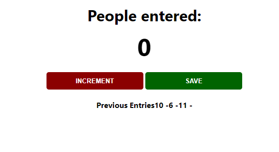

## Readme.md File Main Purpose.

Welcome to our repository!

The main objective of this project is to create small applications using the knowledge gained from personal research and the UCF Bootcamp. I extend a warm invitation to all classmates to delve into the codebase, providing opportunities for refactoring and sharing fresh insights and ideas.

I especially encourage contributions aimed at enhancing CSS. Designing visually appealing interfaces isn't my forte, so any improvements in this area would be greatly valued.

Feel free to adjust as needed!

## 01 - Counter

The first project is a simple counter application aimed at saving the last input counted. However, as you'll notice, there are some display issues that need attention. I firmly believe that simplifying the JavaScript code can significantly enhance the functionality and readability of the application.

## Screenshots

## Authors

- [@MarcioPimentel01](https://www.github.com/marciopimentel01)

